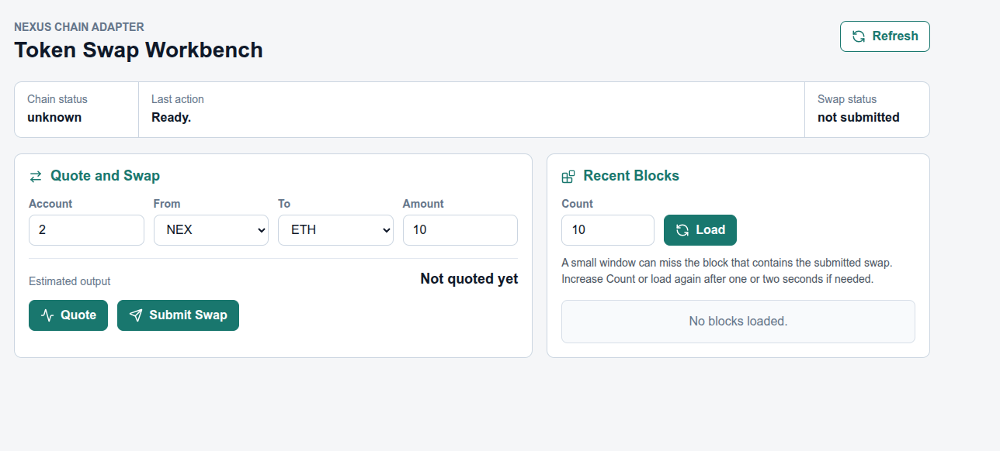
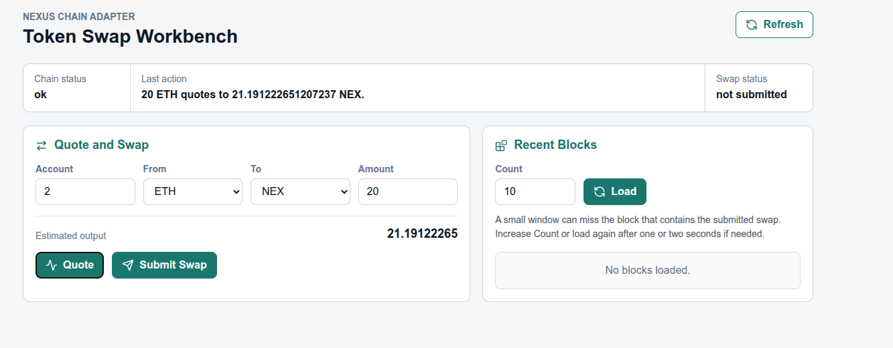
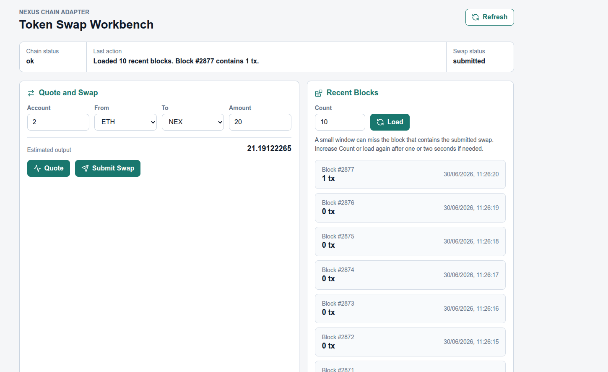

# Frontend Usage Guide

This guide explains how to use the workbench screen and how to interpret the
visible results.

## Access

The normal entry point is `http://localhost:8080/`.

When the Go API is started with `mise run run`, it already serves the frontend
at that URL. A separate frontend server is not required for normal usage.

The optional Vite mode at `http://localhost:5173/` exists only for frontend
development.

## Example States

The initial state shows the screen before any action is executed. In that
moment:

- chain status can still be `unknown`
- no quote has been requested yet
- no blocks have been loaded yet

After a valid quote request:

- `Last action` shows the quoted conversion
- `Estimated output` displays the returned amount
- swap status is still `not submitted`

After a successful swap and a later blocks load:

- swap status is `submitted`
- `Last action` reports which recent block window was loaded
- a block with `1 tx` indicates that a transaction was included in chain
  history

## Screen Areas

### Chain Status Area

This area reflects `GET /v1/chain/status`.

At the current implementation level, it should be read as a lightweight
availability check:

- `ok` means the Go API can still reach the Rust chain service
- it does not expose account balances or a richer chain snapshot

### Quote And Swap Area

This area is used to build a swap request:

- `Account`: the account id used for the swap
- `From`: input token
- `To`: output token
- `Amount`: input amount

`Quote` requests an estimated output amount. `Submit Swap` sends the swap to the
backend.

### Recent Blocks Area

This area displays recent blocks returned by `GET /v1/blocks?n=<count>`.

Each card should be read as one chain history entry:

- `Block #53` is the block identifier
- the date and time show when that block was produced
- `0 tx` means that block contains no included transactions
- `1 tx` means that block contains one included transaction

The blocks list is not a list of swaps. It is a list of history entries
produced by the Rust chain. Some entries are empty. Some contain one or more
transactions.

## Manual Flow

1. Open `http://localhost:8080/`.
2. Click `Refresh`.
3. Confirm that chain status becomes `ok`.
4. Choose an account, token pair, and amount.
5. Click `Quote`.
6. Confirm that an estimated output appears.
7. Click `Submit Swap`.
8. Confirm that swap status becomes `submitted`.
9. Click `Load` in the recent blocks area.
10. If the newest blocks still show `0 tx`, wait one or two seconds and load
    blocks again.

## Post-Swap Behavior In The Example UI

The current example UI applies a small amount of automation after `Submit
Swap`:

- the swap status changes to `submitted`
- the screen waits briefly for block production to advance
- the recent blocks list is loaded automatically

The blocks area uses `Count = 10` by default because a very small window can
miss the block that contains the submitted swap.

If the blocks area still shows only `0 tx` entries after submission, that does
not mean the swap failed. It usually means one of these cases:

- the swap was accepted, but the currently loaded window does not yet include
  the block where it was recorded
- the block was produced slightly later than the current refresh moment
- the block containing the swap already moved outside a very small recent-block
  window

The practical next step is:

1. wait one or two seconds
2. click `Load` again
3. if needed, increase `Count`

The most useful confirmation currently available in the example UI is a later
block showing a non-zero transaction count such as `1 tx`.

## What To Verify In The UI

The current UI is useful for confirming:

- the Go API is reachable
- the Rust chain service is reachable through the Go API
- quote calculation is working
- a swap request was accepted
- the chain is still producing blocks
- a later block eventually shows a non-zero transaction count

After `Submit Swap`, the most useful visual confirmation currently available in
the UI is a later block with `1 tx` or another non-zero count.

The current UI does not directly verify:

- account balance changes after the swap
- the raw transaction payload shown by the Rust service

Deeper confirmation of the underlying block payload belongs to the API response
from `GET /v1/blocks` and is described in
[System Operation Flow](../system/operation-flow.md).
