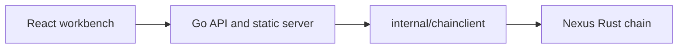

# Architecture

Token Swap Workbench is a thin adapter over the Nexus Rust chain. The Go API
owns HTTP request handling, validation, use case orchestration, and response
shaping. The Rust chain remains the source of truth for chain behavior.

## Runtime shape



## Package layout

```text
cmd/api/
  main.go                 API entrypoint
  modules/chain.go        chain module wiring

internal/app/chain/
  domain/                 chain-facing domain types
  handler/{operation}/    one HTTP handler package per operation
  usecase/{operation}/    application logic and client-facing interfaces

internal/chainclient/     HTTP client for the Rust chain service
internal/bootstrap/       router and server wiring
internal/config/          Viper-backed configuration

web/app/                  React/Vite source
web/static/               built frontend assets
```

## Request flow

1. `cmd/api/main.go` loads configuration and creates the bootstrap app.
2. `internal/bootstrap` creates the router, middleware, health route, static
   file routes, and versioned API route group.
3. `cmd/api/modules/chain.go` registers the chain domain operations under
   `/v1`.
4. Each `internal/app/chain/handler/{operation}` package parses HTTP input,
   validates request data, calls the matching use case, and writes JSON.
5. Each `internal/app/chain/usecase/{operation}` package depends on a narrow
   client interface instead of the concrete Rust client.
6. `internal/chainclient` adapts Go requests to the Rust Nexus chain HTTP API.

## Frontend delivery

The React workbench lives under `web/app`. Production-style local runs build the
frontend into `web/static`, then the Go server serves:

- `/` from `web/static/index.html`
- `/static/*` from `web/static`
- `/v1/*` from the Go API

For frontend iteration, Vite runs on port `5173` and proxies `/health` and
`/v1` to the Go server on port `8080`.

Frontend-specific documentation lives under [frontend/README.md](../frontend/README.md).
