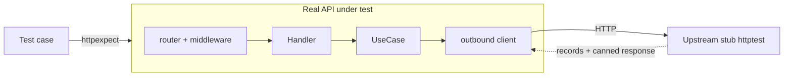
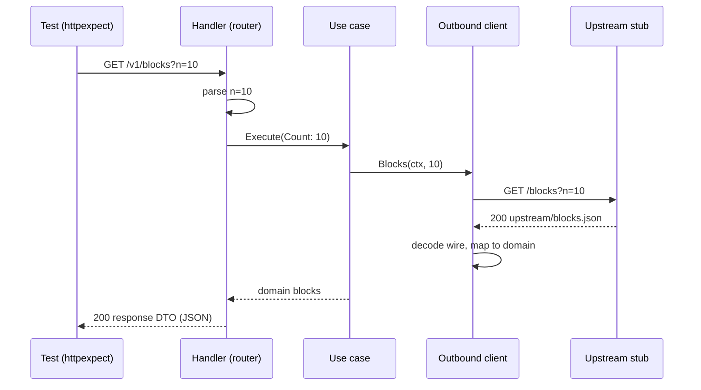

# Integration Testing Guide

Integration tests drive the whole HTTP stack for one operation at a time, with
the external service swapped for a controllable stub. There is no database and
no real external network call, so every run is deterministic.

Run them with:

```bash
mise run integration
```

## What each test validates

Every test checks three things at once for one endpoint:

1. The API translates the external service's response into its own contract,
   dropping fields it does not expose.
2. The API returns the right status and body to the caller.
3. The API called the external service the right way (method, path, query).

## What is real and what is a stub

Everything the API owns runs for real, so the code path matches production. Only
the external service the API integrates with is replaced.



| Component | Real or stub | Notes |
|---|---|---|
| Router, middleware | Real | Built by the production router wiring |
| Handlers, use cases | Real | Same wiring as `cmd/api` |
| Outbound client | Real | Real HTTP request, response, and JSON mapping |
| External service | Stub | An `httptest.Server` owned by the suite |
| Database | none | The project has no database |

Both the API and the stub are real HTTP servers on localhost. The request goes
over a real TCP connection, so request building, query encoding, response
decoding, and error classification are all covered.

## Who starts the server and who calls it

Two pieces do the transport work, one from the standard library and one from a
third-party package:

- `httptest.NewServer` (standard library, `net/http/httptest`) starts a real
  HTTP server on a random loopback port. The generic suite calls it in
  `StartAPI`, passing the production router. `TearDownTest` closes it.
- `httpexpect.Default` (`github.com/gavv/httpexpect/v2`) builds an HTTP client
  bound to that server URL. `Expect()` returns it, and a call chain such as
  `.GET(...).Expect()` opens a real connection and sends the request.

```go
func (s *Suite) StartAPI(handler http.Handler) {
    s.api = httptest.NewServer(handler)
}

func (s *Suite) Expect() *httpexpect.Expect {
    return httpexpect.Default(s.T(), s.api.URL)
}
```

So `Expect` is not standard library, and it does make the real call. The test
is a genuine end-to-end HTTP round trip on loopback, not an in-memory handler
call.

## How a request flows

For `GET /v1/blocks?n=10`:



## Suite infrastructure

The infrastructure is split into two layers so the reusable part stays free of
any domain knowledge.

**Generic suite** (`internal/testing/integration/suite`)

- Starts the system under test from any `http.Handler`.
- Runs an endpoint-agnostic upstream stub that records every request and serves
  responses registered per method and path.
- Exposes an httpexpect client bound to the API and a helper to read golden
  files.

It knows nothing about specific routes, payloads, or the domain.

**Domain suite** (one per bounded context, for example
`internal/app/chain/test/chainsuite`)

- Embeds the generic suite.
- Wires the real router to the stub during setup, using the same constructors
  the application entrypoint uses.
- Exposes helpers named in domain terms so tests configure the stub and read
  captured requests without touching transport details.

## Anatomy of a test

Each test embeds a domain suite and follows the same four steps. The example
below is one concrete case, and every test reads the same way.

```go
func (s *ListBlocksSuite) TestListBlocks_ShouldReturnHistory() {
    // 1. Arrange: tell the stub what the external service would answer.
    s.ChainReturnsBlocks(s.ReadFile("testdata/upstream/blocks.json"))

    // 2. Act: call the real API through httpexpect.
    response := s.Expect().GET("/v1/blocks").
        WithQuery("n", "10").
        Expect()

    // 3. Assert the response the API returned (whole-object golden).
    response.Status(http.StatusOK)
    s.Require().JSONEq(s.ReadFile("testdata/response/blocks.json"), response.Body().Raw())

    // 4. Assert what the API forwarded to the external service.
    forwarded := s.LastChainRequest()
    s.Equal(http.MethodGet, forwarded.Method)
    s.Equal("/blocks", forwarded.Path)
    s.Equal("10", forwarded.Query.Get("n"))
}
```

Step 4 is what makes these tests useful for a black-box adapter. They assert
not only the response the client sees, but also that the API translated the
call into the correct upstream request.

## Failure injection

The stub can be told to return non-2xx statuses or malformed bodies, which lets
tests cover error mapping. A 4xx from the external service surfaces as
`400 Bad Request` (the caller's fault), while a 5xx, a transport error, or an
unparsable body surfaces as `502 Bad Gateway` (the service is unavailable).
